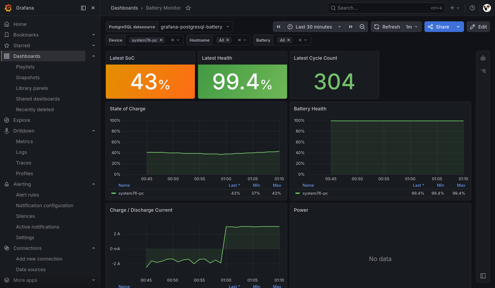

# Battery Monitor

Battery Monitor collects laptop battery health samples from Linux and macOS clients and stores them in a PostgreSQL-backed API.



**Grafana should be configured separately** (*only [json](./grafana/dashboards/battery-monitor-postgres.json) is provided*)

## What It Collects

The client sends every supported metric it can discover:

- Battery state of charge
- Designed capacity
- Current full capacity
- Charging or discharging current
- Cycle count
- Voltage, temperature, power, health percentage, battery status, and other available values

## Local Server

```bash
cp .env.example .env
docker compose up --build
```

The API listens on `http://localhost:3000`.
Prisma Studio listens on `http://localhost:5555`.

Useful endpoints:

- `GET /healthz`
- `POST /api/v1/samples`
- `GET /api/v1/devices/:deviceId/samples`

Database access uses Prisma ORM. Migrations live in `prisma/migrations`, and the schema is defined in `prisma/schema.prisma`.

```bash
npm run db:generate
npm run db:migrate
```

`docker compose` uses local `.env` through `env_file` for development. Keep `.env` scoped to local runtime values only. GitHub Actions values such as `GITOPS_REPOSITORY` belong in GitHub repository settings, not local `.env`.

Prisma Client generation does not connect to PostgreSQL. Prisma 7 still requires `DATABASE_URL` to be present while loading `prisma.config.js`, so the Docker build uses a build-only placeholder URL for `prisma generate`. Runtime commands such as `prisma migrate deploy`, the API server, and Prisma Studio use the real `DATABASE_URL` injected by Compose locally or by K3s in the cluster.

## Client

The client is a Python 3 script using only the standard library.

```bash
cp client/.env.example client/.env
BATTERY_MONITOR_API_URL=http://localhost:3000 \
BATTERY_MONITOR_DEVICE_ID="$(hostname)" \
python3 client/battery_collector.py
```

Install cron:

```bash
BATTERY_MONITOR_API_URL=https://battery-api.example.com \
BATTERY_MONITOR_DEVICE_ID="$(hostname)" \
BATTERY_MONITOR_API_TOKEN=change-me \
./client/install_cron.sh
```

Bluetooth keyboard battery SoC can be sent with the separate keyboard client:

```bash
BATTERY_MONITOR_API_URL=https://battery-api.example.com \
BATTERY_MONITOR_API_TOKEN=change-me \
BATTERY_MONITOR_DRY_RUN=1 \
python3 client/bluetooth_keyboard/bluetooth_keyboard_collector.py
```

Set `BATTERY_MONITOR_KEYBOARD_NAME` to filter a specific keyboard name. Set `BATTERY_MONITOR_KEYBOARD_DEVICE_ID` only if you want to override the default keyboard-specific device id. Install its cron entry with `./client/bluetooth_keyboard/install_cron.sh`.
On Linux, the keyboard client tries `/sys/class/power_supply`, `upower`, and `bluetoothctl` because Bluetooth HID battery reporting depends on the device and BlueZ/kernel support.

## Container Image

GitHub Actions builds and pushes:

```text
ghcr.io/<owner>/<repo>:<branch-or-tag>
ghcr.io/<owner>/<repo>:<sha>
```

Set `BATTERY_MONITOR_API_TOKEN` as a repository secret if you want the deployment manifest to require clients to send a bearer token.

## GitOps Dispatch

This repository does not store K3s, ArgoCD, or deployment manifests. The private GitOps repository owns those files.

After GitHub Actions builds and pushes the container image, it can trigger the private GitOps repository with `repository_dispatch`.

Configure these in this app repository:

- GitHub Settings > Secrets and variables > Actions > Variables: `GITOPS_REPOSITORY`, in `owner/repo` form
- GitHub Settings > Secrets and variables > Actions > Secrets: `GITOPS_REPO_TOKEN`, with access to dispatch to the target repo

The event type is `image-published`. The payload includes the app name, source repo, ref, sha, image tags, and image digest.

## Grafana

An importable PostgreSQL dashboard template is available at:

```text
grafana/dashboards/battery-monitor-postgres.json
```

Import it in Grafana, then select the PostgreSQL datasource from the dashboard's `PostgreSQL datasource` dropdown. The dashboard includes filters for device, hostname, and battery name; each defaults to `All`.

## OpenTelemetry

The API enables tracing when standard OpenTelemetry environment variables are present. The K3s GitOps deployment injects:

```text
OTEL_SERVICE_NAME=battery-monitor
OTEL_EXPORTER_OTLP_ENDPOINT=http://otel-collector.observability:4318
OTEL_EXPORTER_OTLP_PROTOCOL=http/protobuf
OTEL_RESOURCE_ATTRIBUTES=deployment.environment=prod,k8s.namespace.name=battery-monitor
```

HTTP, Express, PostgreSQL, and Prisma spans are instrumented. `/healthz` probe traffic is ignored.
